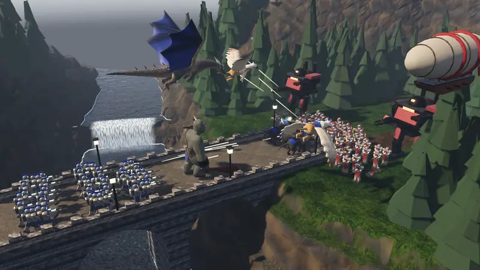
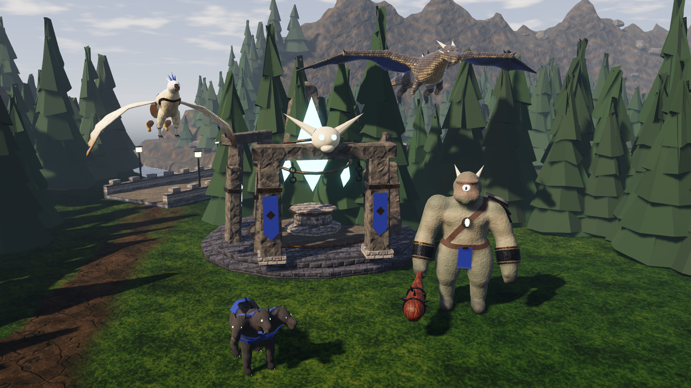
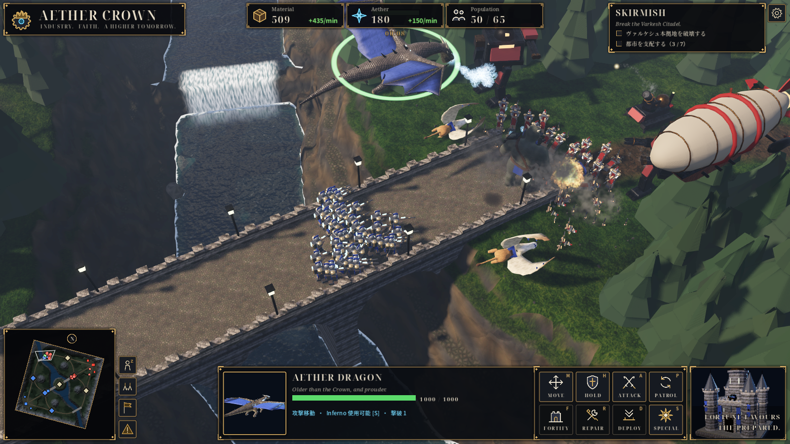
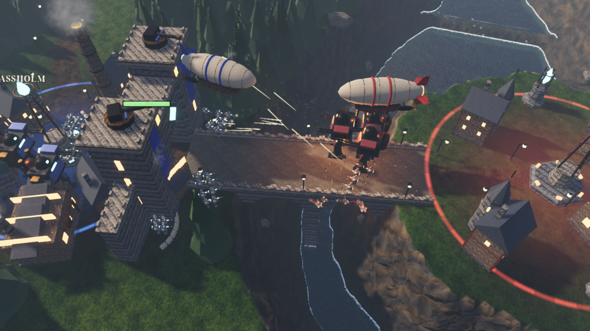
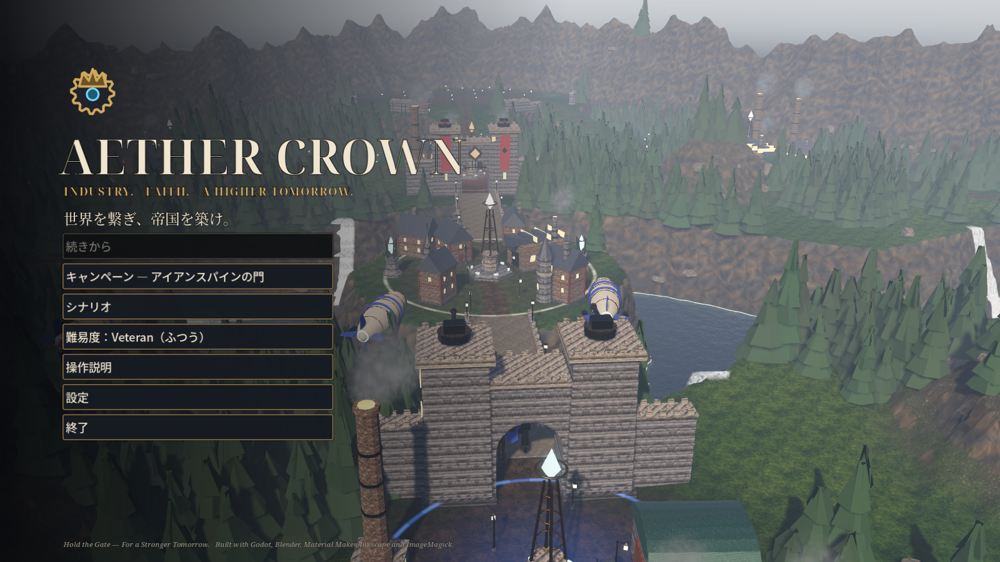

# Aether Crown: Ironspine

工業と魔導（エーテル）が交わる大地を舞台にした、Godot 4 製の3Dクォータービュー RTS です。
渓谷に架かるアイアンスパイン門を守り抜き、中央ネクサスを奪って、ヴァルケシュ本拠地を破壊します。



| 神獣の祠 | 戦闘画面 |
|---|---|
|  |  |
| **北西の橋** | **タイトル** |
|  |  |

## 起動

**ブラウザで遊ぶ**：<https://dma-cmyk.github.io/aether-crown-ironspine/>（PC とスマホ・タブレット。スマホは横向きで）。
初回は約 80MB を読み込みます。ブラウザ版は WebGL 2 の描画（Godot の Compatibility レンダラー）なので、配布版と少し見え方が違います。
セーブと設定はブラウザの中に保存されます。スマホではメニューの「全画面の切り替え」で全画面になります（iPhone の Safari は非対応なので、ホーム画面に追加すると全画面で開けます）。

**ダウンロードして遊ぶ**：[Releases](https://github.com/dma-cmyk/aether-crown-ironspine/releases/latest) から Linux 版（`.tar.gz`）か Windows 版（`.zip`）を落として展開し、
`AetherCrownIronspine.x86_64` か `AetherCrownIronspine.exe` を起動します（Vulkan 対応の GPU が必要）。
Windows で「PC が保護されました」と出たら、「詳細情報」→「実行」で起動できます（署名のない実行ファイルのため）。

ソースから動かす場合は Godot 4.7（`godot` コマンド）を入れて:

```bash
./run.sh            # 初回は自動でアセットをインポートしてから起動
# または
godot --path game
```

- 画質は タイトル → 設定 で「低 / 中 / 高」。内蔵 GPU では「中」で約 50fps（大規模な戦闘中は約 37fps）、「低」で約 65fps（同 約 50fps）。1600x900、Intel Iris Xe、100Hz の垂直同期ありで計測。
- F11 でフルスクリーン切替。

## 遊び方

**キャンペーン（3ミッション）と自由戦**

| ミッション | 内容 |
|---|---|
| アイアンスパインの門 | 4回の攻撃波から門を守り、援軍と合流して敵本拠地を破壊する |
| 北の中継塔 | 前線から北の中継塔を奪い、反撃に耐えて3分間守り抜く |
| 鉄の潮 | 3方向から来る8回の攻勢に耐え、12分間本拠地を守り抜く |
| 自由戦 | 台本なしの通常対戦（敵 AI は最初から攻めてくる） |

勝利すると「次のミッションへ」で続きに進めます。タイトルの「シナリオ」からはどのミッションも選べます。
試合中は Esc のメニューから「セーブ」「ロード」（3枠）ができ、タイトルの「続きから」でも再開できます。

**第1ミッション「アイアンスパインの門」の流れ**

1. 開始から約5分半、ヴァルケシュ軍が中央の橋から4回攻めてくる。アイアンスパイン門の前で迎え撃つ。
2. 援軍（歩行機・飛行艦など）が到着したら、中央ネクサスを占領する。
3. 橋の先のヴァルケシュ本拠地（北東）を破壊すれば勝利。自軍の本拠地を失うと敗北。

都市のリレー塔の輪に地上部隊を置くと占領でき、資材・エーテル・人口上限が増えます（工兵は占領が速い）。

**建設**：本拠地・城門・自軍の都市の周りに建てられます。建てる場所を選んでいる間は地面にマス目が出て、緑は建てられる所、黄は木を切り倒して建てられる所、赤は岩・建物・急な斜面で建てられない所です。木の上に置くと、建設が始まるときに木が倒れます。

**神獣・悪魔・天使**：建設メニューの「祠・塔」から祠を建てて呼べます。神獣の祠でケルベロス・サイクロプス・グリフォン・ドラゴン、悪魔の祠で悪魔、天使の祠で天使を呼びます。
悪魔は燃える爪で周りの敵をまとめて引き裂き、天使は空から光の槍を放って味方を回復します。
機械ではないので修理はできませんが、戦闘から離れると自然に回復します。敵のヴァルケシュも祠を建てて使ってきます。

**巨神・機動兵・天罰の塔**：本拠地で建造できる巨神（同時に1体）は、口からの光線で周りを焼き払い、特殊能力「巨神の光」で一直線をなぎ払う切り札です。とても強いかわりに体が少しずつ崩れていき、約11分で倒れます。
飛行場で作れる機動兵は、空を飛んで肩のミサイルで建物と拠点を壊すロボットです（歩兵には効きにくく、対空攻撃に弱い）。

**ギアフォージ機**：工廠の疾走機（安くて速い二脚）と四脚砲（遠くから撃つ二連装砲）、飛行場の空中戦艦（舷側砲・臼砲・対空砲を積んだ巨艦）、本拠地の鋼の巨兵（同時に1体。遠くから装甲と建物を撃ち抜くエーテル砲の巨人）。
建設メニューの「祠・塔」にある天罰の塔（1人1基）は、約4分ごとにマップのどこへでも光の柱を落とせるマップ兵器です。撃つと相手にも着弾地点が知らされ、10秒後に着弾します。本拠地と城門へのダメージには上限があります。敵のヴァルケシュも建てて撃ってくるので、見つけたら壊しに行きましょう。

**遮蔽**：木・家・城壁・岩は通れず、陰にいる部隊を銃弾・直射の砲弾・光線から守ります（家・城壁・岩は半分、木は4分の1を防ぐ）。
臼砲・爆発・近接攻撃は防げません。

| 操作 | 内容 |
|---|---|
| 左クリック / 左ドラッグ | 選択（Shift で追加、ダブルクリックで同種を全選択） |
| 右クリック | 移動・攻撃・修理（建物選択中は集結地点）。Shift で経由地点 |
| M / H / A / P | 移動 / 陣地保持 / 攻撃移動 / 巡回 |
| F / R / D / S | 構え / 修理 / 展開（臼砲の射程延長） / 特殊能力 |
| Q W E R T Y U | 選択中の建物で生産（本拠地は B で建設メニュー） |
| Ctrl+数字 / 数字 | 部隊登録 / 呼び出し |
| 矢印・画面端・ホイール・中ドラッグ | カメラ移動・ズーム・回転 |
| Home / Space / F1 / F2 / F3 / Esc | 本拠地 / 最新の警報 / 待機ユニット / 全戦闘部隊 / FPS 表示 / メニュー |

スマホ・タブレットでは指で操作します（タッチ端末では操作用の小さい画面配置になります）。

| タッチ操作 | 内容 |
|---|---|
| タップ | 自軍を選択（すばやく2回で画面内の同種を全選択）。選択中なら地面へ移動・敵を攻撃・建物の集結地点 |
| 長押しして指を動かす / 長押しして離す | 範囲選択 / 敵も含めて選択（何もない所なら解除） |
| 1本指ドラッグ / 2本指 | カメラ移動 / 広げる・つまむでズーム、ひねって回転 |
| 右下のボタン | コマンド・生産・建設（押すと説明が出る）。移動先などを選ぶ間は上の「取消」でやめられる |
| 建設 | 建物のボタンを押したまま地面へ引き出し、指を離すとそこに建設（建物は指の少し上に出る）。仮置きした建物も指で引いて動かせる。タップ → 地面をタップで仮置き → もう一度タップで建設、もできる |

ゲーム内の「操作説明」（タイトル画面とポーズメニュー）にも同じ内容があります（タッチ端末ではタッチ用の説明）。「部隊一覧」のタブでは、全ユニットの費用と役割を確かめられます。

## 自作シナリオ

タイトルの「シナリオ」から、内蔵のミッションと自作のシナリオを選んで遊べます。
シナリオは JSON ファイル1つで、マップ・初期部隊・目標・試合中のイベント（「5分たったら援軍」など）を書きます。
書き方は [docs/scenarios.md](docs/scenarios.md)、実例は内蔵の `game/scenarios/hold_the_gate.json` です。

## 構成

```
game/                  Godot プロジェクト（Mobile レンダラー、GDScript）
  data/map_ironspine.json   マップ設計（地形・道・橋・都市・初期配置）の唯一の元データ
  scenarios/           内蔵シナリオ（ミッションの進行・目標・イベント）
  scripts/core|units|buildings|combat|ai|ui|world   ゲームロジックと UI
  shaders/             地形・水・滝・空・粒子・霧・歩兵の頂点アニメ
  assets/              生成済みアセット（terrain / models / textures / fx / ui / audio）
tools/                 アセット生成スクリプトと書き出し（export.sh = Linux / Windows、export_web.sh = ブラウザ版）
  blender/terrain/     地形パイプライン（mapgen.py = numpy で高さ場など、build_terrain.py = Blender で .blend/.glb 化）
  blender/models/      環境プロップ・建物・ユニットの手続きモデリング（神獣は骨付きのスキンメッシュ）
  blender/gearforge/   前作 Aether Crown のギアフォージ機の生成スクリプトと、部品分け・テクスチャ焼き込み（build.py, bake.py）
  textures/            Material Maker（CLI 書き出し）＋ ImageMagick、神獣の皮・鱗・毛・羽は numpy で生成
  ui/make_icons.py     HUD アイコン（SVG）
  ui/make_splash.sh    起動画面（ブラウザ版の読み込み画面も兼ねる）
  audio/gen_audio.py   効果音（WAV）・環境音とBGM（MP3）の合成（numpy・ffmpeg）
  fonts/subset_fonts.py  同梱する Noto フォントのサブセット（ゲームの文字＋かな）
  web/browser_check.py   ブラウザ版を Chrome で動かして確認（スマホの模擬・タッチ・撮影・FPS）
art/blend/             生成された .blend（Blender で開いて確認・編集できる）
docs/                  設計メモとスクリーンショット
```

地形は「Blender Python 地形生成スクリプト → .blend → .glb → Godot」の順に作られます。
高さ場・歩行可能グリッド・地表スプラット・ミニマップ・木や街の配置も同じスクリプトから出力されます。

## アセットの再生成

```bash
tools/build_all.sh            # すべて再生成して Godot へ再インポート
tools/build_all.sh terrain    # 段階を指定: terrain | models | textures | fx | icons | audio | import
```

配布用のパッケージは `tools/export.sh v1.0.0` で `build/` に作ります（Linux の .tar.gz と Windows の .zip。Godot 4.7.2 のエクスポートテンプレートが必要）。

使用ツール: Blender 5.2、Material Maker 1.7、ImageMagick 7、Inkscape（アイコン確認）、uv・ffmpeg（音声生成）、Godot 4.7。
Material Maker は CLI 書き出し後も終了しないため、`build_textures.sh` は出力ファイルを待ってから終了させています。

## 開発用オプション

```bash
# 画面を撮影して終了（平均 FPS と GPU 時間も表示）
godot --path game -- --capture=x --out=/tmp/x.png --frames=400 [--cam=x,z,yaw,dist[,pitch]] [--scenario=showcase] [--quality=0..2]
# README の画像（--nohud で HUD なし、--select=dragon で選択、--title でタイトル画面。動画は Godot の --write-movie）
godot --path game --fixed-fps 30 -- --capture=x --mission=res://scenarios/skirmish.json --scenario=bridge --cam=-116,-124,15,48,24 --cam_up=4 --nohud --nolabels --frames=120 --out=/tmp/battle.png
godot --path game -- --capture=x --mission=res://scenarios/skirmish.json --scenario=lineup --cam=-136.2,-55,-15,27,11 --cam_up=7 --nohud --nolabels --frames=80 --out=/tmp/beasts.png
# プレイヤー側をボットが操作し、ミッションを早回しで最後まで流す（ヘッドレス可）
godot --headless --path game -- --match --autoplay --timescale=10
# 全モデルの確認用ギャラリー
godot --path game -- --gallery=all --out=/tmp/gallery.png
# シナリオファイルの検証（誤りがあると終了コード 1）
godot --headless --path game -- --check-scenarios
# スマホ相当の画面とタッチ操作（--touch で強制。ブラウザ版は ?touch=1 / ?touch=0）
godot --path game --resolution 844x390 --rendering-method gl_compatibility -- --touch
# 合成タッチで選択・命令・カメラ・建設・メニューを確かめる（ブラウザ版は ?scenario=touch_test&capture=x&frames=1000000&keep）
godot --path game --resolution 844x390 -- --capture=x --frames=1000000 --keep --touch --scenario=touch_test
# ブラウザ版の書き出しと確認（GitHub Pages には main への push で Actions が書き出して載せる）
tools/export_web.sh && python3 -m http.server -d build/web 8060
uv run tools/web/browser_check.py --phone --out /tmp/web '[["wait",3],["shot","title.png"]]'
# 試合中の自動セーブと、セーブからの再開
godot --headless --path game -- --match --autoplay --save-at=150 --save-to=/tmp/s.json
godot --path game -- --load=/tmp/s.json
```

Web 版のBGMと環境音はブラウザがMP3を再生し、短い効果音はGodotが再生します。`tools/export_web.sh` がMP3を配置し、PWAのオフラインキャッシュにも登録します。

自軍の全17種のユニットは、選択・移動・攻撃の命令にそれぞれ固有の短い日本語で返事をします。歩兵・工兵・艦長・機械・神獣・天使・悪魔ごとに話者、台詞、速さ、音色を変えています。音声はローカルの VOICEVOX Nemo エンジンで事前生成し、ゲームには短い WAV を同梱します。再生成はエンジンを起動して `uv run tools/audio/gen_voices.py`。使用音声: **VOICEVOX Nemo：男声1〜3・女声1〜6**（[利用規約](https://voicevox.hiroshiba.jp/nemo/term/)）。

設計の詳細は [docs/design.md](docs/design.md) を参照。

## ライセンス

[MIT License](LICENSE)。配布用パッケージには、Godot Engine と同梱ライブラリのライセンス表記（`THIRD-PARTY-NOTICES.txt`）も入れています。
